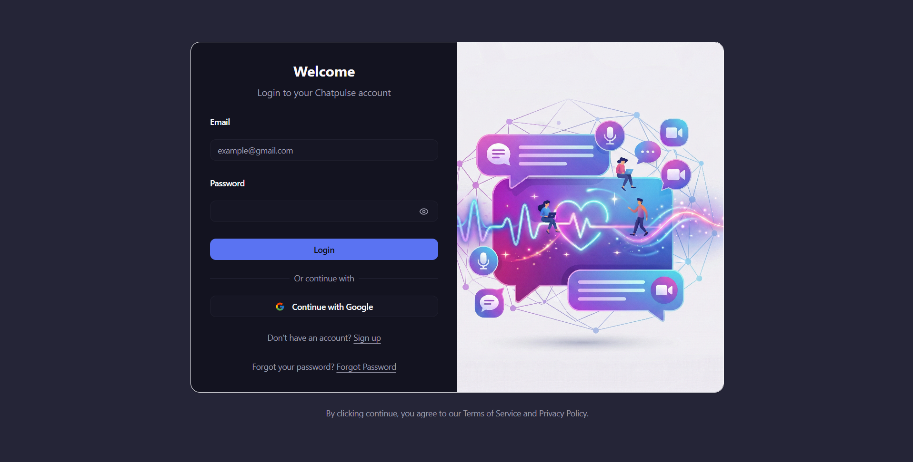
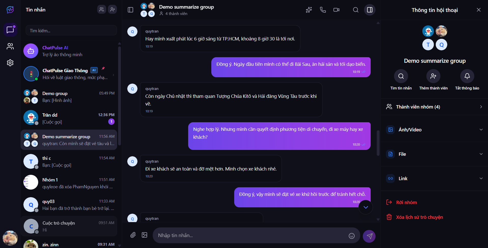
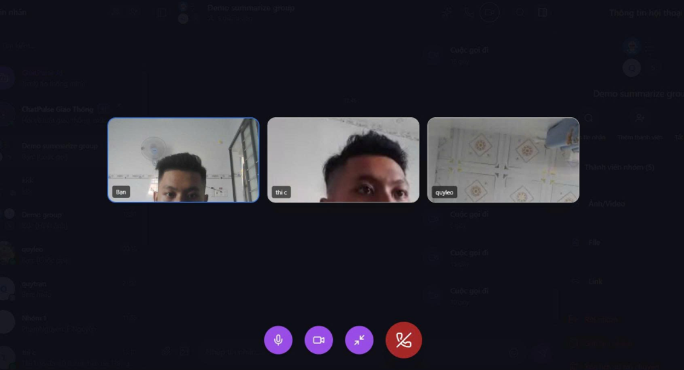
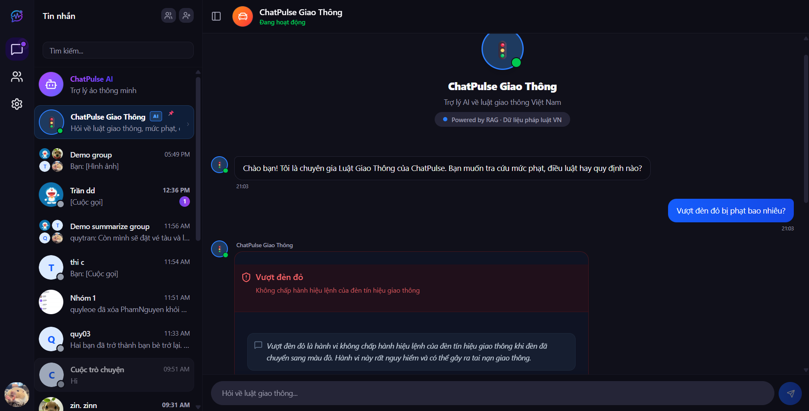
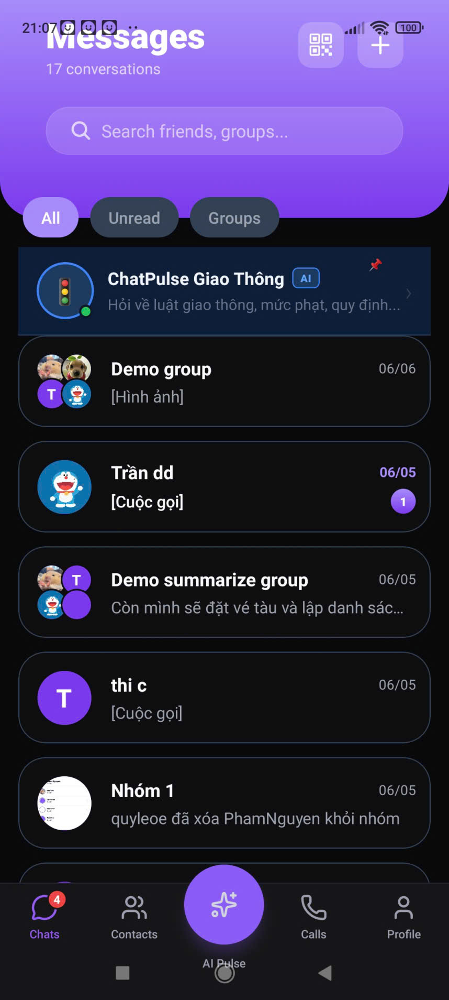
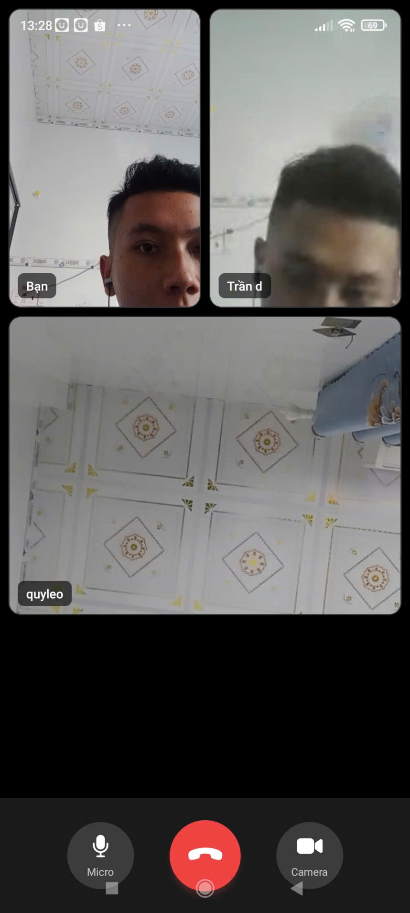
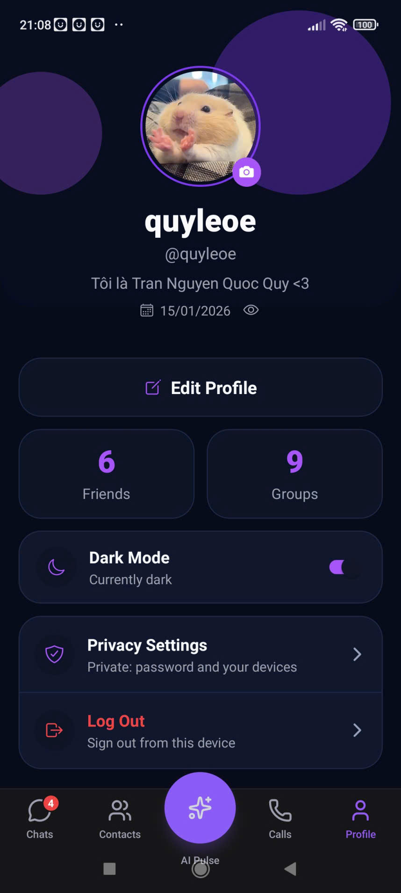
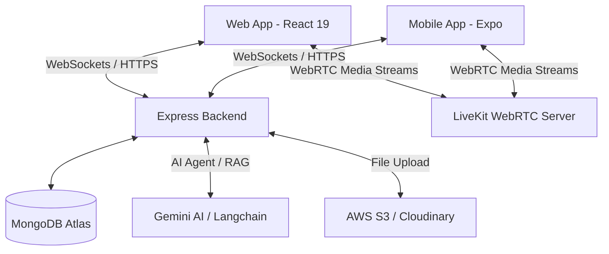

# 💬 ChatPulse - Nền tảng Nhắn tin & Gọi Video Real-time Đa nền tảng (Web & Mobile)

> **ChatPulse** là một hệ thống truyền thông thời gian thực (real-time) toàn diện, hoạt động mượt mà trên cả Web và Mobile. Dự án nổi bật với các công nghệ hiện đại như Mã hóa đầu cuối (E2EE) để bảo vệ quyền riêng tư, Gọi video/audio chất lượng cao qua WebRTC, và tích hợp Trợ lý AI phân tích tài liệu thông minh.

[](#)
[](#)
[](#)
[](#)
[](#)
[](#)

---

## 🚀 Demo & Tài khoản Trải nghiệm

- **Link Live Demo (Web App):** [chatpulse-frontend.vercel.app](https://chatpulse-frontend.vercel.app/)
- **Tài khoản trải nghiệm nhanh (Dành cho nhà tuyển dụng):**
  - **Email:** `dd@gmail.com`
  - **Mật khẩu (Password):** `111111`

_(Bạn cũng có thể tự đăng ký tài khoản mới trực tiếp trên giao diện để trải nghiệm toàn bộ tính năng)._

---

## 📸 Giao diện Hệ thống (Screenshots)

### 🖥️ Giao diện Web Client

_Giao diện Web được xây dựng tối ưu cho màn hình Desktop và Tablet, hỗ trợ giao diện sáng/tối (Dark/Light mode) và bố cục responsive._

|                   Trang Đăng nhập & Đăng ký                    |           Phòng Chat chính (Direct Message & Groups)           |
| :------------------------------------------------------------: | :------------------------------------------------------------: |
|        |       |
| _Hỗ trợ đăng nhập nhanh bằng tài khoản test hoặc đăng ký mới._ | _Danh sách phòng chat, lịch sử tin nhắn, và thanh công cụ AI._ |

|                Cuộc gọi Video & Audio (WebRTC)                 |               Giao diện Trợ lý AI (Langchain)                |
| :------------------------------------------------------------: | :----------------------------------------------------------: |
|          |  |
| _Cuộc gọi video thời gian thực độ trễ thấp thông qua LiveKit._ |    _Đọc hiểu tài liệu PDF/DOCX và chat trực tiếp với AI._    |

### 📱 Giao diện Mobile App (React Native)

_Giao diện Mobile được thiết kế chuẩn Native bằng React Native Paper và React Navigation, tối ưu hóa cử chỉ vuốt và hiển thị tốt trên cả iOS và Android._

|                   Trang chủ & Danh sách Chat                    |                       Cuộc gọi Video di động                        |                    Trang cá nhân & Cài đặt                    |
| :-------------------------------------------------------------: | :-----------------------------------------------------------------: | :-----------------------------------------------------------: |
|          |         |  |
| _Hiển thị danh sách tin nhắn gần nhất và trạng thái hoạt động._ | _Giao diện cuộc gọi native hỗ trợ camera trước/sau và bật tắt mic._ |  _Quản lý thông tin cá nhân, đồng bộ khóa E2EE qua QR Code._  |

---

## ✨ Các Tính Năng Nổi Bật

- **Trải nghiệm đa nền tảng (Cross-Platform):** Đồng bộ hóa mượt mà giữa phiên bản **Web** (React 19, Tailwind v4) và **Mobile** (React Native qua Expo).
- **Trò chuyện thời gian thực (Real-time Chat):** Gửi tin nhắn, trạng thái online/offline, thông báo đang nhập văn bản (typing indicator) và trạng thái tin nhắn (đã gửi/đã đọc) thông qua **Socket.io**.
- **Mã hóa đầu cuối (End-to-End Encryption - E2EE):** Cơ chế mã hóa lai (hybrid encryption) kết hợp giữa **RSA** và **AES** (`jsencrypt` & `crypto-js`). Nội dung tin nhắn chỉ có người gửi và người nhận đọc được, máy chủ (server) hoàn toàn không thể giải mã.
- **Gọi Video & Audio chất lượng cao:** Thực hiện các cuộc gọi cá nhân hoặc cuộc gọi nhóm thời gian thực, độ trễ cực thấp dựa trên **LiveKit (WebRTC)** và **Simple Peer**.
- **Trợ lý AI & Trích xuất tài liệu:** Tích hợp **Gemini AI** / **Groq** và **Langchain** để phân tích tài liệu trực tiếp trong cửa sổ chat. Hỗ trợ đọc các định dạng file PDF, DOCX, XLSX để trả lời câu hỏi của người dùng.
- **Quản lý file & Email chuyên nghiệp:** Upload tệp tin dung lượng lớn qua **AWS S3** và **Cloudinary**; Gửi email xác thực tài khoản và thông báo qua **AWS SES** / **Nodemailer**.

---

## 🛠️ Công Nghệ Sử Dụng (Tech Stack)

### Giao diện (Frontend & Mobile)

- **Web client:** React 19, Vite, TailwindCSS v4, Radix UI (shadcn)
- **Mobile client:** React Native (Expo SDK 54/55), React Navigation, React Native Paper
- **Quản lý trạng thái & Caching:** Zustand, TanStack React Query (v5)
- **Kết nối mạng:** Axios, Socket.io-client, LiveKit-client, Simple-peer

### Máy chủ & Cơ sở dữ liệu (Backend & Database)

- **Runtime & Web Framework:** Node.js, Express, TypeScript
- **Cơ sở dữ liệu:** MongoDB (Sử dụng Driver gốc để tối ưu hóa truy vấn)
- **Real-Time & WebRTC:** Socket.io, LiveKit Server SDK
- **Trí tuệ nhân tạo (AI):** Langchain, Google Generative AI, Groq SDK
- **Lưu trữ & Dịch vụ:** Multer (xử lý file), Cloudinary & AWS S3 (lưu trữ cloud), AWS SES & Nodemailer (gửi mail)

---

## 📐 Kiến Trúc Hệ Thống (Architecture)



### 🔒 Cơ chế hoạt động của Mã hóa đầu cuối (E2EE):

1. **Khởi tạo khóa:** Khi đăng ký, thiết bị của người dùng sẽ tự tạo một cặp khóa RSA (Public Key & Private Key). **Public Key** được gửi lên server để chia sẻ, còn **Private Key** được lưu trữ an toàn trong bộ nhớ thiết bị của người dùng (không gửi lên server).
2. **Mã hóa tin nhắn:** Khi gửi tin nhắn, thiết bị tự sinh ra một khóa đối xứng AES ngẫu nhiên. Nội dung tin nhắn sẽ được mã hóa bằng khóa AES này.
3. **Trao đổi khóa:** Khóa AES tiếp tục được mã hóa bằng **RSA Public Key** của người nhận trước khi gửi lên server.
4. **Giải mã:** Khi người nhận tải tin nhắn về, thiết bị dùng **RSA Private Key** của mình để giải mã khóa AES, sau đó dùng khóa AES giải mã nội dung tin nhắn ban đầu.

---

## 🧠 Thử Thách Kỹ Thuật & Bài Học Kinh Nghiệm

### 1. Đồng bộ hóa và Bảo mật khóa Private Key trên đa thiết bị

- **Vấn đề:** Làm sao để người dùng sử dụng cả Web và Mobile đều có thể đọc được tin nhắn E2EE mà không cần truyền khóa Private Key thô (raw) lên máy chủ backend.
- **Giải pháp:** Thiết kế quy trình sao lưu khóa được mã hóa bằng mật khẩu cấp 2 (Passcode) của người dùng thông qua hàm KDF (PBKDF2) hoặc sử dụng mã QR Code chứa khóa riêng tư để đồng bộ trực tiếp qua kết nối local P2P giữa hai thiết bị.

### 2. Tối ưu hóa chất lượng cuộc gọi WebRTC trên thiết bị di động

- **Vấn đề:** Trên thiết bị di động (Mobile), khi mạng yếu hoặc thay đổi từ WiFi sang 4G thường xuyên xảy ra tình trạng mất kết nối cuộc gọi.
- **Giải pháp:** Sử dụng cơ chế tái thiết lập kết nối (reconnection) tự động của LiveKit SDK kết hợp cấu hình băng thông thích ứng (simulcast) để tự động hạ chất lượng video khi mạng yếu, giữ kết nối audio luôn ổn định.

---

## ⚙️ Hướng Dẫn Chạy Dự Án (Local Setup)

### Yêu cầu hệ thống

- Node.js (v18 trở lên)
- MongoDB (Local hoặc MongoDB Atlas)
- Các API Keys: Gemini/Groq, AWS S3 & SES, Cloudinary, LiveKit Server

### Các bước cài đặt chi tiết

1. **Clone repository này:**

   ```bash
   git clone https://github.com/quoc-quy/ChatPulse.git
   cd ChatPulse
   ```

2. **Cài đặt và chạy Backend:**

   ```bash
   cd backend
   npm install
   # Tạo file .env dựa trên các biến môi trường cần thiết
   npm run dev
   ```

3. **Cài đặt và chạy Frontend (Web):**

   ```bash
   cd ../frontend
   npm install
   # Tạo file .env trỏ API_URL về backend
   npm run dev
   ```

4. **Cài đặt và chạy Mobile App:**
   ```bash
   cd ../mobile
   npm install
   npx expo start
   ```

---

## ✉️ Thông Tin Liên Hệ

- **Họ và tên:** Trần Nguyễn Quốc Quý
- **Email:** [quocquytnqq@gmail.com](mailto:quocquytnqq@gmail.com)
- **GitHub:** [github.com/quoc-quy](https://github.com/quoc-quy)
- **LinkedIn:** [Trần Nguyễn Quốc Quý](https://linkedin.com/in/quocquy)

---

_Cảm ơn các nhà tuyển dụng đã dành thời gian xem qua dự án của mình!_
